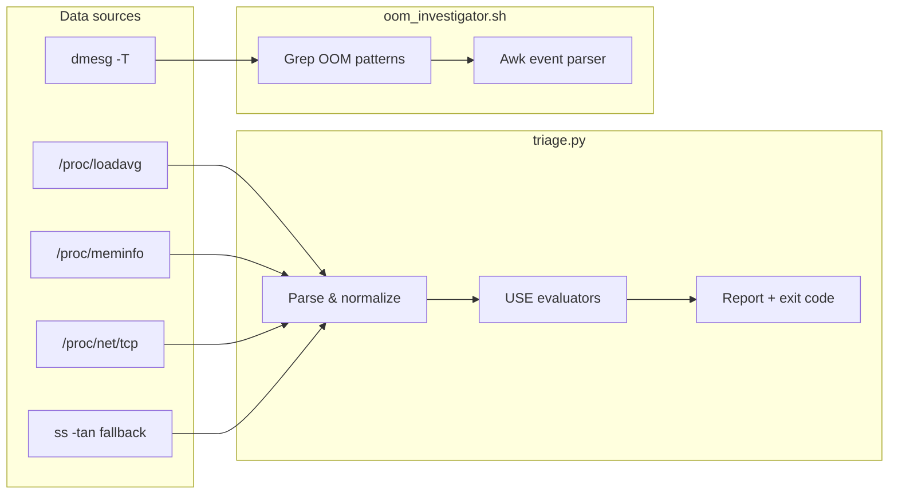

# server-triage-toolkit

**Instant Linux host triage for on-call SRE and DevOps engineers**, using the [USE method](https://www.brendangregg.com/usemethod/use-linux.html) (Utilization, Saturation, Errors). The toolkit ships as **pure Python 3** and **Bash** with **no third-party runtime dependencies**—only the Python standard library and common userland tools already present on production servers.

When an alert fires at 3 a.m., you need a **single command** that separates “noisy neighbor / cache” from **real CPU run-queue saturation**, **true RAM pressure**, and **TCP backlog or TIME-WAIT storms**. This project does that in seconds.

---

## The problem

Modern Linux hosts rarely fail in obvious ways:

| Symptom | Often mistaken for | What USE triage checks |
|--------|---------------------|-------------------------|
| High `load average` | “CPU is maxed” | **Saturation**: run queue vs logical CPU count |
| Low `MemFree` | “We are out of RAM” | **MemAvailable** vs **Buffers/Cached** (reclaimable page cache) |
| Many connections | “Network is fine” | **TIME-WAIT** churn, **Send-Q / Recv-Q** backlogs |

`server-triage-toolkit` reads `/proc` (and falls back to `ss` when needed), classifies each signal as **OK**, **WARNING**, or **CRITICAL**, and prints **actionable recommendations** with color when your terminal supports it.

---

## Features

### `triage.py`

- **CPU saturation** — parses `/proc/loadavg`, counts logical CPUs via `/proc/cpu*` or `online`, computes per-core load (1m / 5m / 15m).
- **Memory pressure** — parses `/proc/meminfo`, splits **MemFree**, **Buffers**, and **Cached**, highlights low **MemAvailable** (real deficit vs page cache).
- **TCP / network** — parses `/proc/net/tcp` socket states and queue depths; optional **`ss -tan`** fallback; flags high **TIME-WAIT** and **Send-Q / Recv-Q**.
- **Colored report** — severity badges, detail bullets, recommendation lines; respects `NO_COLOR` and supports `--no-color`.
- **Exit codes** — `0` OK, `1` WARNING, `2` CRITICAL, `3` collection error (for scripting and CI).

### `scripts/oom_investigator.sh`

- Scans **`dmesg -T`** (when supported) for OOM killer activity.
- Extracts **timestamp**, **PID**, **comm**, and **memory** lines (`total-vm`, `anon-rss`, etc.).
- Limits output (`--limit`) for pager-friendly incident notes.

---

## Requirements

| Component | Requirement |
|-----------|-------------|
| OS | Linux with procfs (`/proc`) |
| Python | 3.8+ (stdlib only) |
| Shell | Bash 4+ / POSIX-oriented Bash circa 2020 |
| Optional | `ss` from iproute2 if `/proc/net/tcp` is unavailable |
| OOM script | `dmesg` (often requires `root` or `CAP_SYSLOG`) |

---

## Installation

No build step. Clone and run:

```bash
git clone https://github.com/your-org/server-triage-toolkit.git
cd server-triage-toolkit
chmod +x triage.py scripts/oom_investigator.sh
```

Optional: add to `PATH`:

```bash
export PATH="$PWD:$PWD/scripts:$PATH"
```

---

## Quick start

```bash
# Host triage (run on the affected Linux server)
./triage.py

# Investigate recent OOM kills (may need sudo)
sudo ./scripts/oom_investigator.sh --limit 10
```

### Options (`triage.py`)

```text
--proc-root PATH          Alternate procfs root (testing: TRIAGE_PROC_ROOT)
--send-q-threshold BYTES  Send-Q alert threshold (default: 1048576)
--recv-q-threshold BYTES  Recv-Q alert threshold (default: 1048576)
--no-color                Disable ANSI colors
```

### Options (`oom_investigator.sh`)

```text
-n, --limit N   Max events (default: 20, env OOM_INVESTIGATOR_LIMIT)
-a, --all       Print all matching events
-q, --quiet     Events only, no banner
```

---

## Example output

### Healthy host (`triage.py`)

```text
server-triage-toolkit — USE snapshot
Host: prod-api-01

✓ OK  CPU Saturation
  CPU run-queue saturation is within normal bounds.
    • Logical CPUs: 8
    • Load average: 1m=0.42, 5m=0.38, 15m=0.35
    • Per-core load: 1m=0.05, 5m=0.05, 15m=0.04
    • Runnable / total tasks: 1/412

✓ OK  Memory Pressure
  Plenty of MemAvailable; most inactive memory is page cache (reclaimable).
    • MemTotal: 15.6 GiB
    • MemFree (physical): 890.2 MiB (5.6%)
    • Buffers + Cached (page cache): 11.2 GiB (71.8%)
    • MemAvailable (kernel estimate): 12.4 GiB (79.5%)
    → No immediate RAM deficit; monitor MemAvailable during traffic spikes.

✓ OK  TCP / Network
  TCP socket states and queue depths look normal.
    • Source: /proc/net/tcp
    • Socket states: ESTAB=124, TIME-WAIT=89, LISTEN=12, other=3
    • TIME-WAIT per core: 11.1

Overall: ✓ OK
```

### Degraded host (WARNING / CRITICAL)

```text
! WARNING  CPU Saturation
  Elevated run-queue saturation; CPU may be a bottleneck.
    • Per-core load: 1m=1.24, 5m=0.92, 15m=0.80
    → Watch 5m/15m trends; sustained per-core load > 1.0 warrants tuning.

✗ CRITICAL  Memory Pressure
  Real memory deficit: MemAvailable is critically low (not just page cache).
    • MemAvailable (kernel estimate): 612.0 MiB (3.8%)
    → Run `scripts/oom_investigator.sh` and inspect recent OOM kills.

✗ CRITICAL  TCP / Network
  Socket queue backlogs detected (Send-Q / Recv-Q saturation).
    • Sockets with Send-Q ≥ 1024.0 KiB: 3
    → Inspect endpoints with `ss -tan state established '( recv-q > 1048576 or send-q > 1048576 )'`.

Overall: ✗ CRITICAL
```

*(Colors appear when stdout is a TTY and `NO_COLOR` is unset.)*

### OOM investigator

```text
OOM Investigator — recent kernel OOM events
Source: dmesg | limit: 10

--- event #1 ---
timestamp: [Fri Sep 25 03:14:02 2025]
raw: Out of memory: Killed process 8842 (java) total-vm:4829312kB, anon-rss:3918848kB, file-rss:0kB
pid: 8842
comm: java
memory: total-vm:4829312kB, anon-rss:3918848kB, file-rss:0kB
```

---

## Architecture

High-level data flow:



### Module layout (`triage.py`)

| Layer | Responsibility |
|-------|----------------|
| **Parsers** | `parse_loadavg`, `parse_meminfo`, `parse_proc_net_tcp`, `parse_ss_tan` — pure functions, easy to unit test |
| **Collectors** | `cpu_core_count`, `collect_tcp_snapshot` — read procfs or invoke `ss` |
| **Evaluators** | `evaluate_cpu`, `evaluate_memory`, `evaluate_tcp` — map metrics → `CheckResult` + severity |
| **Presentation** | `format_report`, ANSI helpers — human output; `overall_severity` drives exit code |

Design choices:

- **Testability** — set `TRIAGE_PROC_ROOT` or `--proc-root` to point at fixture trees in tests.
- **Fail-soft TCP** — prefer `/proc/net/tcp`; use `ss` only when procfs is missing (containers, restricted mounts).
- **Conservative thresholds** — defaults favor on-call signal over false calm; tune via CLI flags for your fleet.

---

## Testing

Tests use **`unittest`** (stdlib). No pytest required.

```bash
python -m unittest discover -s tests -v
```

On a developer machine without Linux `/proc`, tests exercise parsers against **embedded fixtures** in `tests/test_triage.py`.

---

## Operational notes

1. **Run triage on the node that fired the alert**, not from your laptop against remote `/proc`.
2. Pair **`triage.py`** with **`oom_investigator.sh`** when memory severity is WARNING or CRITICAL.
3. Wire exit codes into scripts: `critical=2`, `warning=1` for paging workflows.
4. Set **`NO_COLOR=1`** in log collectors; keep color for interactive SSH.

---

## Contributing

Issues and PRs welcome. Please keep dependencies **stdlib-only** for `triage.py` and avoid adding heavy tooling to the default install path.

Suggested checks before opening a PR:

```bash
python -m unittest discover -s tests -v
shellcheck scripts/oom_investigator.sh   # if available
```

---

## License

MIT — see [LICENSE](LICENSE) (add a LICENSE file when you publish the repository).

---

## Acknowledgments

Inspired by Brendan Gregg’s **USE** and **Linux performance** methodology. Built for engineers who want **fast, honest** host signals without installing an agent.
